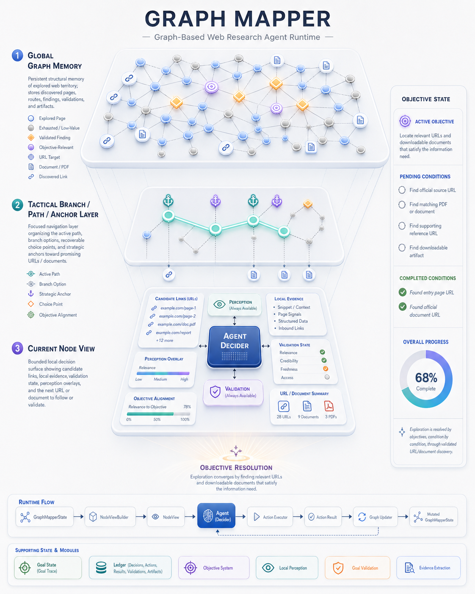

# Graph Mapper Agent

`graph_mapper_agent` is a web research agent built around **structured state**, not just prompt chaining.

It explores websites, follows promising routes, validates whether local content helps satisfy a goal, extracts usable evidence, and records the full run in a persistent SQLite ledger.

What makes it different is that it does not treat web research as a flat sequence of prompts over pages. It treats it as a structured exploration problem with graph memory, branch control, local node interpretation, and explicit validation and evidence steps.



## What It Is

This project is not just a browser wrapper around an LLM.

Its core idea is to treat web exploration as a structured runtime with:

- graph memory of discovered places and routes
- tactical branch and anchor management
- local node views for decision-making
- explicit decider -> executor -> updater flow
- persistent traceability through a ledger

In practice, that means the agent can do more than "look at a page and click something." It can keep track of where it is, what has already been explored, what looks promising, what has already been validated, and what evidence is worth keeping.

## What Makes It Different

The project is built around a few architectural choices that make it different from a typical browser agent.

### Three Graph Levels

The runtime does not operate over a single flat graph abstraction. It effectively works across three levels:

1. **Global graph memory**
   The full explored structure: nodes, edges, visits, findings, validations, and accumulated runtime memory.

2. **Branch / path / anchors**
   The tactical exploration layer: the active path, recoverable choice points, and strategic anchor points that help the agent decide where to continue or where to return when a branch stops being promising.

3. **Current node view**
   The local decision surface seen by the decider: the current node, local evidence, visible candidates, goal state, perception state, and immediate tactical constraints.

This matters because the agent is not asked to reason over the entire run in one giant context window. The runtime compresses the global and tactical state into a local `NodeView` that is small enough to act on but still structurally meaningful.

### Structured State Instead of Narrative Memory

The model is not treated as the global memory of the system.

Instead, the runtime keeps the broader state, and the model receives a bounded structural representation of the current situation. The system is designed around **state understanding**, not around forcing the model to remember the whole causal history of the run.

### Explicit Validation and Evidence Extraction

The agent does not jump directly from "page visited" to "final answer."

It has explicit subdomains for:

- `goal_validation`: determine whether the current local content actually helps satisfy the active goal
- `evidence_extraction`: only after positive validation, extract useful content in a structured way

That keeps evidence handling more disciplined than a simple browse-and-summarize loop.

### Runtime-Centered Decision Support

The LLM is not the whole agent. It is one part of a broader runtime.

The agent already includes focused processing layers such as:

- `navigation_perception`
- `local_perception`
- `goal_validation`
- `evidence_extraction`

These are early forms of the subroutine direction the project is moving toward: specialized state-processing components that reduce complexity before it reaches the decider.

## How It Works

At a high level, the runtime cycles through:

1. inspect the current node
2. build a local tactical view of the current state
3. decide the best next action
4. execute that action
5. update the graph, runtime state, and evidence
6. continue the active branch or return to stronger anchors

The key architectural split is:

- `NodeView`: compact local state for decision-making
- `Decider`: chooses the next action
- `Executor`: performs the chosen action
- `GraphUpdater`: absorbs the result into graph memory and runtime state

## Main Capabilities

- Explore websites through Playwright-based browser tooling hidden behind `WebBrowserTool`
- Build and update a navigable graph of discovered locations and actions
- Manage active branches, recoverable choice points, and strategic return anchors
- Project runtime state into a compact `NodeView` for local decision-making
- Run navigation and local perception passes before action selection
- Validate whether local content satisfies the current goal through `goal_validation`
- Extract evidence only after positive validation
- Persist sessions, runs, steps, LLM calls, evaluations, and evidence in SQLite
- Expose the runtime through programmatic, HTTP, chat, and MCP interfaces

## LLM Runtime Compatibility

The LLM layer is designed as a provider-resolved runtime rather than a single hardcoded backend.

The current runtime planning layer supports:

- `OpenRouter`
- `LM Studio`
- `Ollama`

This makes it possible to combine different model roles across the same run, for example:

- remote reasoning or perception through OpenRouter
- local served models through LM Studio
- local OCR or lightweight structured tasks through Ollama

The compatibility surface lives in the LLM runtime planning and adapter stack under `graph_mapper_agent/platform/llm/` and `graph_mapper_agent/adapters/llm/`.

## Interfaces

The repository currently exposes three main surfaces:

- programmatic runtime execution
- local HTTP interface
- MCP/chat interface on top of the full runtime

## Agent-Friendly Repository

This repository is also structured to be relatively agent-friendly for code-reading and automation workflows.

In practice, that means:

- the architecture is documented in `docs/` instead of being left implicit
- runtime concerns are separated into recognizable layers such as planning, decision, execution, validation, evidence extraction, and ledger
- config profiles are explicit and live under `graph_mapper_agent/bootstrap/configs/`
- the codebase uses stable domain names like `goal_validation`, `NodeView`, `GraphUpdater`, and `evidence_extraction`
- the runtime exposes multiple entry surfaces that are easier for tools and agents to inspect: Python modules, HTTP, and MCP-oriented services

This does not mean the repository is optimized for autonomous coding agents above all else. It means the project tries to make its structure legible enough that a human or an agent can study the system, understand the runtime boundaries, and identify where a change belongs.

## Install and Run

Clone the repository:

```bash
git clone https://github.com/Lachargoy/Graph_Mapper.git
cd Graph_Mapper
```

Create and activate a dedicated environment:

```bash
python -m venv mapper-venv
source mapper-venv/bin/activate
pip install -r requirements.txt
playwright install
```

Choose a config profile:

- `graph_mapper_agent/bootstrap/configs/config_qwen.json` for OpenRouter
- `graph_mapper_agent/bootstrap/configs/config_lm_studio.json` for LM Studio
- `graph_mapper_agent/bootstrap/configs/config_ollama.json` for Ollama

Provider setup:

- For the OpenRouter profile, edit `graph_mapper_agent/bootstrap/configs/config_qwen.json`
- Replace every `PUT_YOUR_OPENROUTER_API_KEY_HERE` value with your real OpenRouter API key
- `config_lm_studio.json` and `config_ollama.json` do not require an OpenRouter key

First-time config notes:

- The default `entry_url` points to `https://html.duckduckgo.com/html/`
- The default `goal` is `"."` as a placeholder
- For real runs, you will usually want to replace the default `goal`
- Change `entry_url` only if you want a different starting workflow than the DuckDuckGo HTML entry point

Basic validation:

```bash
python -m compileall graph_mapper_agent
python -c "import graph_mapper_agent.bootstrap.runner_menu as rm; print(rm.__file__)"
```

Interactive local runner:

```bash
python -m graph_mapper_agent.bootstrap.runner_menu
```

Local HTTP server:

```bash
python -m graph_mapper_agent.interfaces.http.server
```

Default HTTP address:

`127.0.0.1:8791`

Typical first run:

```bash
python -m graph_mapper_agent.interfaces.http.server
```

Then open `http://127.0.0.1:8791`, select a config profile, and launch a run from the UI.

## Documentation

Start here:

- [docs/overview.md](docs/overview.md): project overview and problem framing
- [docs/quickstart.md](docs/quickstart.md): local setup and entry points
- [docs/architecture.md](docs/architecture.md): runtime flow and architectural slices
- [docs/node_identity_and_dom_mutation.md](docs/node_identity_and_dom_mutation.md): node identity, URL anchoring, and DOM mutation
- [docs/future_graph_dynamics.md](docs/future_graph_dynamics.md): future direction for dynamic graph modeling and subroutines
- [docs/README.md](docs/README.md): full docs index

## Project Status

The project already has a serious runtime core:

- the main runtime lives under `graph_mapper_agent/`
- `goal_validation` is now the canonical validation concept
- evidence extraction is wired as an explicit post-validation step
- the runtime, interfaces, and ledger are already integrated
- the LLM runtime already supports multiple providers and backend-specific adapters

Some internal compatibility layers and older technical manuals still remain, but the current codebase is already centered on the newer architecture rather than on the older migration path.

## Design Direction

The long-term direction of the project is to keep pushing toward:

- stronger structural state representation
- better handling of node mutation and dynamic web state
- clearer subroutine architecture below the decider
- cleaner state-action-update data for smaller specialized models

The key principle stays the same:

> the model should not carry the full raw history of the run; it should act from a compact structural understanding of the current state

## Support the Project

This repository is already a functional demo, not just a loose concept.

It has a working runtime, graph-based exploration, validation and evidence flows, multiple interfaces, and multi-provider LLM runtime support. The next major step in the roadmap is to give the system more dimensionality: better modeling of dynamic node mutation, stronger subroutine architecture, and a richer representation of state transitions in digital environments.

If this project is useful to you, or if you want to support continued work on this direction, donations and sponsorship help fund the next stage of development.

Support is especially helpful for:

- continued engineering work on the runtime
- better OCR and document-processing infrastructure
- stronger subroutine and workflow architecture
- deeper experimentation on dynamic graph state

Current support channels:

- [Buy Me a Coffee](https://buymeacoffee.com/aither)
- Direct contact: `lajimenezcha003@gmail.com`

Crypto donations:

- Bitcoin (BTC): `bc1q4m0e3qatw5q6zfx3trp8ntdhg9lm0m7xdxlfv7`
